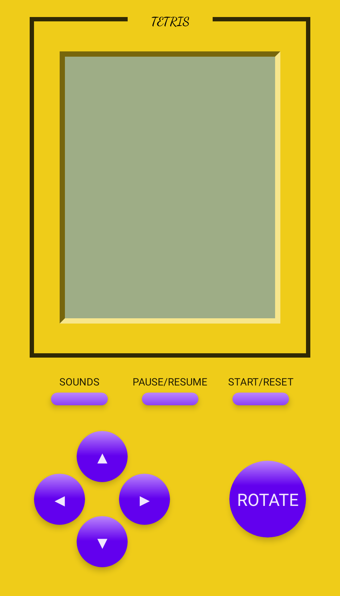

# Compose Tetris

[English](https://github.com/vitaviva/fragivity/blob/master/README.md) | 中文介绍


## :scroll: Description

基于[Jetpack Compose](https://developer.android.com/jetpack/compose)打造的俄罗斯方块游戏。包括AppIcon在内的几乎所有UI元素都由代码实现。




- 基于MVI架构
- 模拟液晶显示效果
- 多种游戏音响
- 致敬[react-tetris](https://github.com/chvin/react-tetris/blob/master/README-EN.md)

下载最新[APK](https://github.com/vitaviva/compose-tetris/actions)

#### 游戏规则：
- 一次消除1行得100分、2行得300分、3行得700分、4行得1500分；
- 方块掉落速度会随着消除的行数增加（每20行增加一个级别）；

<br/>

## :nut_and_bolt: MVI Architecture:


<br/>

## :camera_flash: Screenshots


## License
```
MIT License

Copyright (c) 2021 fundroid

Permission is hereby granted, free of charge, to any person obtaining a copy
of this software and associated documentation files (the "Software"), to deal
in the Software without restriction, including without limitation the rights
to use, copy, modify, merge, publish, distribute, sublicense, and/or sell
copies of the Software, and to permit persons to whom the Software is
furnished to do so, subject to the following conditions:

The above copyright notice and this permission notice shall be included in all
copies or substantial portions of the Software.

THE SOFTWARE IS PROVIDED "AS IS", WITHOUT WARRANTY OF ANY KIND, EXPRESS OR
IMPLIED, INCLUDING BUT NOT LIMITED TO THE WARRANTIES OF MERCHANTABILITY,
FITNESS FOR A PARTICULAR PURPOSE AND NONINFRINGEMENT. IN NO EVENT SHALL THE
AUTHORS OR COPYRIGHT HOLDERS BE LIABLE FOR ANY CLAIM, DAMAGES OR OTHER
LIABILITY, WHETHER IN AN ACTION OF CONTRACT, TORT OR OTHERWISE, ARISING FROM,
OUT OF OR IN CONNECTION WITH THE SOFTWARE OR THE USE OR OTHER DEALINGS IN THE
SOFTWARE.
```